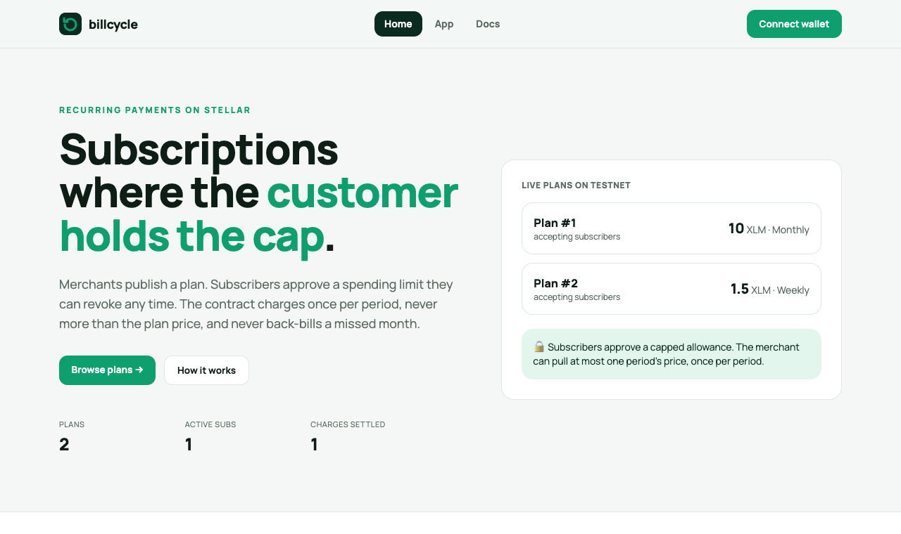

# Billcycle

**Recurring payments on Stellar, without handing anyone your keys.**

A Soroban contract for SaaS plans, memberships, newsletters, gyms and
anything else billed every month. Merchants publish a plan; customers
subscribe by granting a capped, revocable token **allowance**; a keeper
(usually the merchant's cron job) calls `charge` when a period is due.

## Built to be fair to subscribers

| Guarantee | How |
| --- | --- |
| Never charged more than the plan price, at most once per period | `charge` checks `next_charge_at` and pulls exactly `price` |
| **No back-billing** | If charges were missed, the next one covers *one* period and the schedule skips ahead |
| Cancel any time | `cancel` stops all future charges immediately |
| Revoke from your own wallet | Set the token allowance to 0, with no contract call needed |
| A spending cap you control | The allowance you approve is the most the contract can ever pull |

Merchants get something too: a failed pull (allowance or balance too low)
**doesn't revert** the keeper's call. The subscription is marked
`PastDue`, an event is emitted, and the next `charge` retries it once the
customer tops up. One empty wallet can't break a batch of charges.

## Flow

```text
merchant ── create_plan(token, price, period) ───────────▶ plan_id
customer ── token.approve(contract, price × N, expiry) ─▶ (wallet)
customer ── subscribe(plan_id) ── first period charged ─▶ subscription_id
keeper   ── charge(subscription_id) every period ───────▶ true / false (PastDue)
either   ── cancel(subscription_id) ────────────────────▶ no more charges
```

## Contract interface

| Function | Who signs | Notes |
| --- | --- | --- |
| `create_plan(merchant, token, price, period)` | merchant | `period` ≥ 1 hour |
| `deactivate_plan(plan_id)` | merchant | No new subscribers, no further charges |
| `subscribe(subscriber, plan_id)` | subscriber | Charges the first period; needs an allowance ≥ price |
| `charge(subscription_id)` | anyone | Returns `true` if paid, `false` if marked PastDue |
| `cancel(caller, subscription_id)` | subscriber or merchant | |
| `is_due`, `get_plan`, `get_subscription` | anyone | Read state |

Errors: `PlanNotFound (1)`, `SubscriptionNotFound (2)`, `InvalidPlan (3)`,
`PlanInactive (4)`, `NotDue (5)`, `Cancelled (6)`, `NotMerchant (7)`,
`NotSubscriber (8)`, `InitialPaymentFailed (9)`.

Events: `("sub","plan")`, `("sub","started", plan_id)`,
`("sub","charged", sub_id)`, `("sub","pastdue")`, `("sub","cancel")`.

## Build, test and deploy

```bash
cd contracts
cargo test              # 11 unit tests
stellar contract build
stellar contract deploy --wasm target/wasm32v1-none/release/subscriptions.wasm \
  --source me --network testnet
```

A minimal keeper is a cron job that calls `is_due` and then `charge` for
each active subscription id. Index ids from the `("sub","started")` events.

## Web app



A subscriptions app for both sides of the contract, at `web/`:

- **Browse plans**: every active plan with price and period. Subscribe in two steps: approve a spending cap (N periods, with a matching expiry), then subscribe and pay the first period.
- **My subscriptions**: status (active, past due, cancelled), next charge date and periods paid, with cancel and "charge now" when due. Any address can be looked up read-only.
- **For merchants**: publish a plan (any asset; hourly, weekly, monthly or yearly), see subscribers per plan, and deactivate a plan.
- Live stats in the header: plans, active subscriptions and monthly XLM volume.

```bash
cd web
npm install
npm run dev        # http://localhost:5173
```

It talks to the contract deployed on **Stellar testnet** and signs with
[Freighter](https://www.freighter.app) (switch it to Testnet). Point it at
another deployment with `VITE_CONTRACT_ID` (see `web/.env.example`).
`netlify.toml` at the repo root deploys it as-is.

## Documentation

- [Architecture](docs/architecture.md)
- [Testnet deployment](docs/deployment.md)
- [Running a keeper](docs/running-a-keeper.md)
- [Contributing](CONTRIBUTING.md) · [Security policy](SECURITY.md) · [Changelog](CHANGELOG.md)

## Glossary (new to Stellar?)

- **Allowance**: permission you give a contract to move up to a set
  amount of your tokens, until an expiry ledger. You set it with the
  token's `approve` and can lower it to zero whenever you like.
- **Pull payment**: the merchant's contract *takes* the payment within the
  allowance, rather than the customer sending it each time.
- **Keeper**: any bot or script that calls `charge` on schedule. It needs
  no special permission; the allowance is the authorization.
- **Back-billing**: charging for past periods all at once. This contract
  never does it.
- **Soroban / SAC**: Stellar's smart-contract platform / the contract
  address representing a Stellar asset such as XLM or USDC.

## License

MIT
